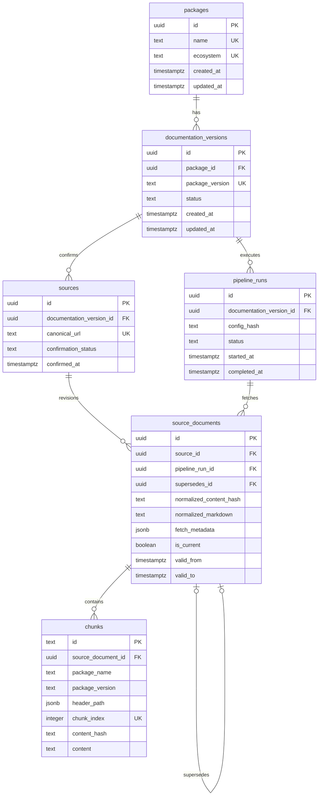

# Stage 4 review stop B: lineage schema

Status: validated against a disposable PostgreSQL/pgvector database; not applied
to the persistent development database.

## Schema



## Review decisions

- Package names are stored in normalized PyPI form and constrained in the
  database; `(ecosystem, name)` is unique.
- Package versions, runs, and sources are separate records so a crawl can be
  reproduced without mixing versions.
- Fetched documents are append-only revisions. A partial unique index allows
  only one current revision for a source and canonical URL.
- Chunks retain their deterministic text IDs and reference the exact document
  revision from which they were produced.
- Package name and version are duplicated on chunks for safe, direct metadata
  filtering; foreign-key lineage remains authoritative.
- PostgreSQL generates UUIDs and UTC-aware timestamps. Update triggers maintain
  `updated_at` on mutable identity/status tables.
- Foreign keys use `RESTRICT`; history cannot disappear through cascading
  deletes.
- The migration enables `vector`, but embedding columns and similarity indexes
  remain deferred until Stage 5 freezes the embedding model and dimension.

## Migration safety

The proposed migration is
`migrations/versions/0001_stage4_lineage_schema.py`. Review its offline SQL
before applying it:

```bash
alembic upgrade head --sql
```

After approval, review stop B validation will apply the migration to an empty
disposable database first, inspect constraints and the extension, then test
downgrade and upgrade. The persistent development database must not be the
first application target.

Downgrade removes the six Stage 4 tables and the project trigger function. It
does not drop the `vector` extension because that extension may be shared.

## Disposable database validation

Review stop B was validated against a temporary database and the database was
removed afterward. The persistent `autodocs` database was not targeted.

Validated behavior:

- upgrade from an empty database to `0001_stage4_lineage`;
- six expected lineage tables and pgvector `0.8.6` present;
- constraints, partial current-revision index, and update triggers present;
- no embedding columns created;
- complete package-to-chunk insert succeeds inside a rolled-back transaction;
- normalized package-name constraint rejects invalid input;
- `updated_at` advances for multiple writes in one transaction;
- a second upgrade is a no-op;
- downgrade removes project tables and triggers while retaining pgvector;
- re-upgrade recreates the expected schema.
